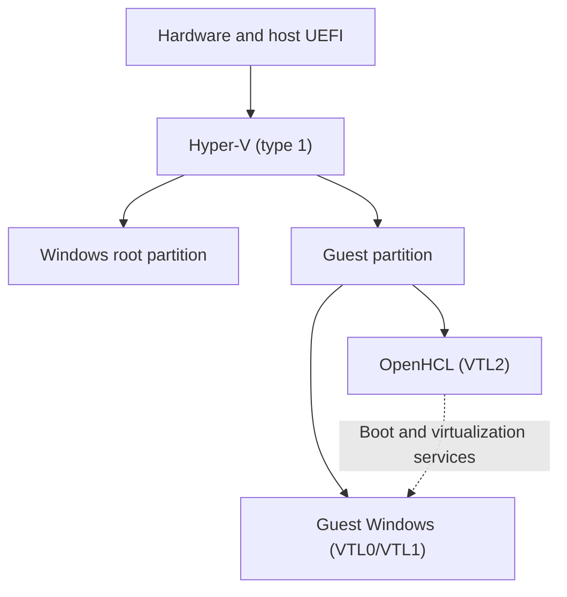

<!-- SPDX-FileCopyrightText: 2026 SANSI GROUP -->
<!-- SPDX-License-Identifier: LicenseRef-Limiar-Private-Use-1.0 -->

# Limiar Firmware Reference Base

Status: selected public source reference. Profile parsing and metadata
generation are tested. No binary built from this exact profile has been
packaged, booted, GPU-tested or released yet.

The base demonstrates editable guest-facing firmware metadata with
project-owned names. It is a starting point for independent virtualization
projects, not a complete export of the Limiar laboratory or an application
compatibility guarantee.

The listed original profile, generator, test and documentation use the
[Limiar Private-Use License](../LICENSE-LIMIAR): private use and adaptation
are allowed; sale and redistribution need written permission. This does
not relicense upstream firmware or earlier releases. See the
[component license map](../LICENSING.md) before packaging a combined image.

## Neutral Profile

[limiar-reference.json](../profiles/openhcl/limiar-reference.json) uses the
existing schema-v2 generator in
[Firmware.psm1](../scripts/openhcl/Firmware.psm1):

| Area | Reference values |
|---|---|
| BIOS / UEFI vendor | Limiar |
| System | Limiar Virtual Desktop |
| Baseboard | Limiar Reference Board |
| Chassis | Limiar desktop, type 3 |
| ACPI identity | LIMIAR / LMRBOARD / LMAR |
| ACPI preferred power profile | Desktop, value 1 |

These are editable defaults. String lengths, allowed characters, numeric
enums and schema validation still apply to user preferences. The reference
keeps the SMBIOS VM characteristic enabled and inherits the existing
firmware producer's table-publication policies. The public generator
does not expose the private experimental ACPI publication controls or
select runtime CPU changes.

The profile contains no fixed UUID, serial number, MAC address or copied
physical-computer identity. Per-VM identifiers remain runtime-owned.
Only the supported BIOS, Type 1/2/3 and ACPI fields are configured here;
unconfigured firmware/device fields retain their producer behavior.
Consequently, profile generation is not proof that every field of a
future firmware image is neutral. A binary candidate needs raw readback.

Validate the reference without creating files or modifying a VM:

```powershell
pwsh -NoProfile -File tests/openhcl_limiar_profile.ps1
```

The profile is opt-in. Existing profiles, preparation defaults and running
VMs are unchanged. This distribution contains the profile, metadata
generator and tests, not upstream firmware sources, producer patches,
an image builder or an installer. Integration into a complete firmware
build and validation of that binary remain separate work.

## Feasibility And Limits

A separate internal configuration has demonstrated native Hyper-V plus
OpenHCL in real VTL2, custom guest UEFI, raw SMBIOS/ACPI readback and
hardware D3D11 GPU-PV rendering within the same Windows guest. This
establishes combined firmware/graphics feasibility beyond renaming a VM
or editing a guest registry label.

That result does not validate this new neutral profile in a live guest.
It also does not establish unrestricted hardware/CPU control, universal
application acceptance, presentation latency or end-to-end Looking Glass.
The detailed lab study and its firmware images are not part of this base.

## Runtime Model

Hyper-V is a type-1 hypervisor even when the user works in a Windows
desktop. Windows management and device services run in its root
partition. OpenHCL is a paravisor inside the guest partition; changing
guest firmware does not replace the physical host's UEFI or Hyper-V L0.



This is a runtime overview, not a claim that the guest is protected from
every host or device vulnerability. Shared-device and management paths
have their own isolation contracts.

## Looking Glass

The Looking Glass integration is the intended complete public delivery:
capture in the guest, frame transport and viewer/input on the physical
Windows machine, with build instructions and tests. It should not depend
on the unpublished firmware study. Its implementation and performance
must be validated separately; no completed delivery is claimed here.

## References

- [Microsoft Hyper-V architecture](https://learn.microsoft.com/en-us/windows-server/virtualization/hyper-v/architecture)
- [OpenHCL architecture](https://openvmm.dev/guide/reference/architecture/openhcl.html)
- [Neutral-profile tests](../tests/openhcl_limiar_profile.ps1)
